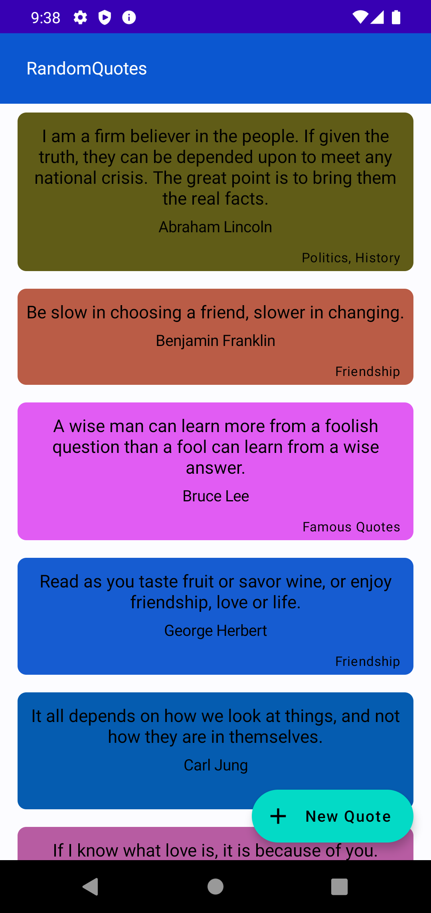

# Random Quotes Android App

# Brief Overview
This is a sample project to illustrate some interesting android concepts. 
The random quotes are fetched from https://api.quotable.io/quotes/random.

# Language
- Kotlin

## Architecture
Android Model-View-ViewModel (MVVM) design architecture was used with the Repository
pattern. This is to prevent tight-coupling of components (allowing for proper
separation of concerns) thereby favoring testability, easier code maintenance
and extensibility as the code base grows.

# Libraries Used
- `Hilt` - For Dependency Injection
- `Coroutines` - For Background Tasks
- `Jetpack Compose` - For UI

## Screenshot

